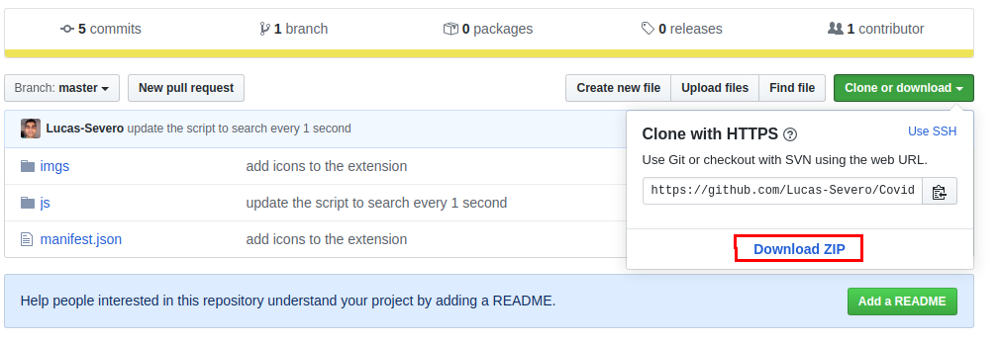
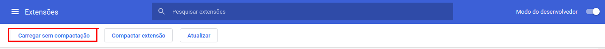
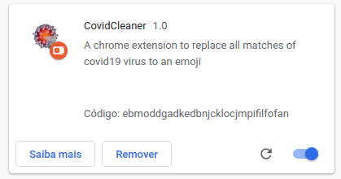

<div align="center">
    <h1>CovidCleaner</h1>
    <p style="text-weight: bold">Uma extensão do google chrome para retirar todas as palavras relacionadas ao coronavírus e substituí-la por 💉</p>
    
</div>

<h2>Instalação</h2>
<p>Primeiro baixe o repositório para a sua máquina, para isso digite: </p>

```sh
git clone git@github.com:Lucas-Severo/CovidCleaner.git
```

ou clique em Download ZIP e depois extraia a pasta para seu diretório de preferência



<hr/>
<h3>Agora vá até o google chrome e digite na barra de pesquisa 

```chrome://extensions```

</h3>

<p>Assim carregará uma página, nesta página ative o modo desenvolvedor no canto superior direito</p>


<hr/>

<p>Com o modo desenvolvedor ativo, aparecerá uma nova opção</p>
<p>Clique em Carregar sem compactação</p>

<hr/>

<p>Isso, abrirá um popup para selecionar a extensão que você quer carregar</p>
<p>Navegue até o caminho onde você salvou o projeto e selecione a pasta que você baixou</p>
<p>Dessa forma a extensão será aberta e ativada</p>


<p>Agora pesquise algo no google ou em qualquer site, e as palavras relacionadas ao Corona Vírus serão substituídas.</p>
